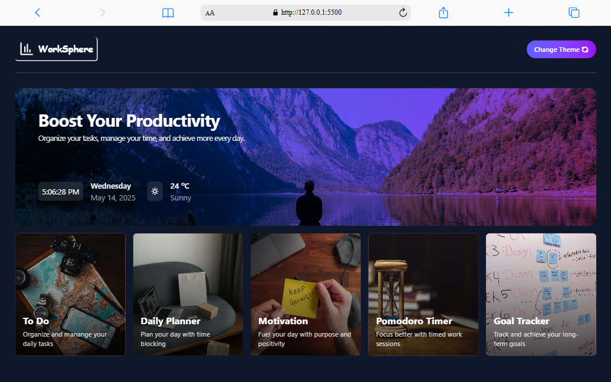
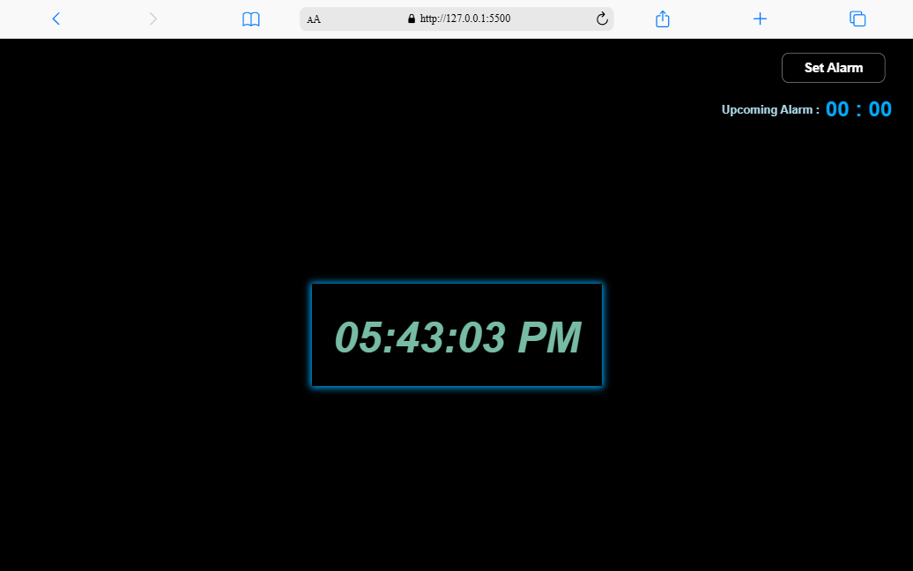
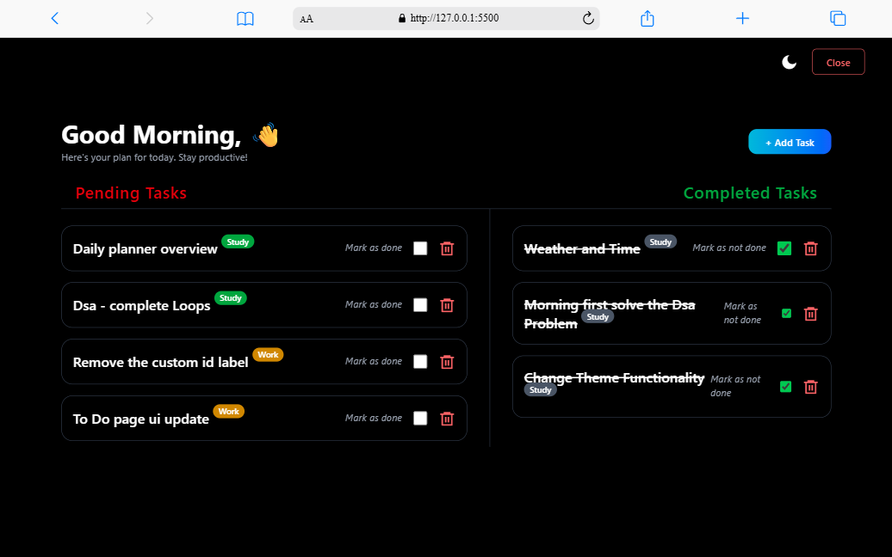

# 🚀 WorkSphere — Your All-in-One Productivity Hub

> ✨ _Stay focused. Stay organized. Stay inspired._  
> 🎯 _Crafted for professionals, students, and remote workers who value efficiency._

---

## 🧩 Overview

**WorkSphere** is a beautifully designed, responsive productivity dashboard that centralizes essential tools to streamline your daily workflow. From managing your tasks and planning your day to tracking time and finding daily motivation, WorkSphere empowers you to operate at your best — every single day.

---

## 📸 Live Preview

🔗 **[View Live Project](https://your-live-demo-link.com)**  
📂 **[View Source Code](https://github.com/keshav7662/WorkSphere.git)**

---

## 🎯 Features at a Glance

✅ **To-Do Manager** – Add, manage, and check off tasks effortlessly.  
📅 **Daily Planner** – Structure your day with clarity and control.  
💬 **Motivational Quotes** – Get inspired every time you log in.  
⏳ **Pomodoro Timer** – Improve focus using time-tested techniques.  
☀️ **Weather Widget** – Get real-time weather updates.  
🕒 **Live Clock & Date** – Always know the current time and day.  
🌗 **Theme Toggle** – Switch between light & dark modes.  
📱 **Fully Responsive** – Works flawlessly on mobile, tablet, and desktop.

---

## 🖥️ Tech Stack

| Tech                 | Purpose                    |
| -------------------- | -------------------------- |
| **HTML5**            | Markup Structure           |
| **Tailwind CSS**     | Responsive, modern styling |
| **JavaScript (ES6)** | Interactivity and logic    |
| **Remix Icons**      | Clean, elegant iconography |

---

## 💡 Inspiration

> “Success doesn’t come from what you do occasionally. It comes from what you do consistently.”  
> — _Marie Forleo_

This project was born out of a personal need to maintain clarity and focus in a chaotic digital world. WorkSphere simplifies your workflow, so you can focus on what truly matters.

---

| Dashboard                         | Timer                 | Dark Mode                     |
| --------------------------------- | --------------------- | ----------------------------- |
|  |  |  |

👨‍💻 About Me
Hi! I'm Keshav, a passionate Fullstack Developer actively seeking exciting job opportunities in the tech space.

📫 Email: keshavverma472@gmail.com
🔗 Portfolio: [Portfolio](https://keshavkumar.vercel.app/)
💼 LinkedIn: [linkedin](https://www.linkedin.com/in/keshavkumar7662/)

Open to Frontend / Fullstack roles · Available Immediately · Willing to Relocate or Work Remotely

🌟 Why WorkSphere?

✅ Fully responsive & accessible
✅ Clean UI with professional aesthetic
✅ Shows your skill in modern web development
✅ Demonstrates real-world utility and UX thought process
✅ Built from scratch — no frameworks or templates used

---
